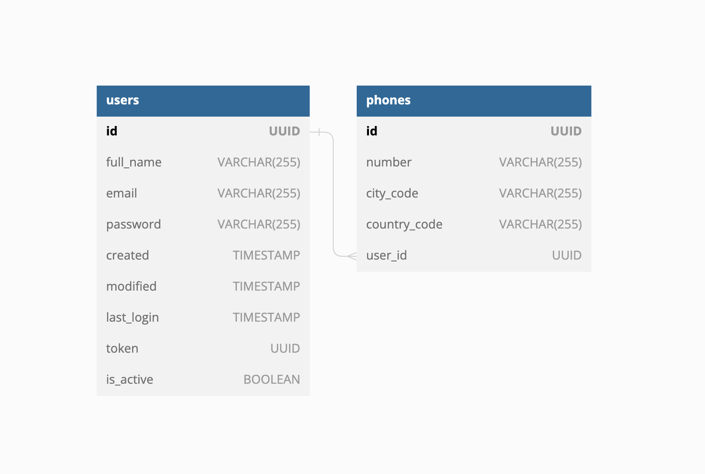
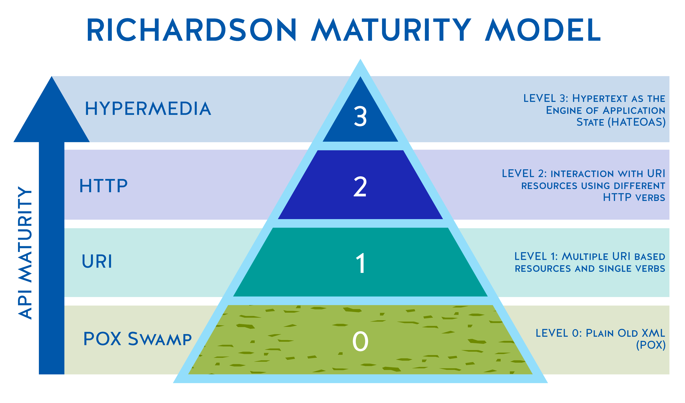

# USERS API - This is a RESTful API service to persist and retrieve users.

____________________

## Solution based on:

##### Jacoco report for coverage

##### Mockito

##### Junit 5

##### Swagger

##### Lombok

##### Java 17.0.5-oracle

##### Spring Boot 3.0.5 - I used Spring Boot 3, it's include a better way to handle a feedback error using RFC 7807, there is I not used a `{"message": "some error"}`

____________________

##  Getting Started
____________________

### Parameters

To run this APP properly run correctly, the following properties must be configured.

For dev and local environment, simply you can use the default values on the specific property file.
The files are in on __src/main/resources__ and the name is application.yaml

The BD schema is created when the application starts.

```
resources/bd/schema.sql
```

# How to test and run

### - Run test with coverage

* ```mvn clean verify```
* Then open `index.html` at `target/site/jacoco/` to see the coverage report.

### - Run clean

* ```mvn clean```

### - Run app locally

* ```mvn exec:java```
---------------
### - URL SWAGGER UI
[SWAGGER UI URL](http://localhost:8080/swagger-ui/index.html#/)

### Open API
[OPEN API FILE](openApi.json)

## - Utils Url (examples)

#### CREATE an user
```
curl --location 'localhost:8080/v1/user/create' \
--header 'Content-Type: application/json' \
--data-raw '{
    "name": "Luis",
    "email": "w@dominio.cl",
    "password": "1234",
    "phones":[{
        "number": "12345678",
        "cityCode": "0",
        "countryCode": "56"
    }]
}   '
```
#### GET an User by id
```
curl --location 'localhost:8080/v1/user/5afe3621-0471-4b32-80d8-13de9e838e5e'
```

#### UPDATE an User
```
curl --location --request PUT 'localhost:8080/v1/user/update/5afe3621-0471-4b32-80d8-13de9e838e5e' \
--header 'Content-Type: application/json' \
--data-raw '{
    "name": "Ramon",
    "email": "wqq@dominio.cl",
    "password": "1234",
    "phones":[{
        "number": "999999999",
        "cityCode": "1",
        "countryCode": "54"
    },
    {
        "number": "8888888888",
        "cityCode": "2",
        "countryCode": "51"
    }]
}   '
```

#### DEACTIVATE an User
```
curl --location --request PATCH 'localhost:8080/v1/user/update/f3bfb949-e58e-46bd-94e5-8a0ddc6a1c5f'
```
------------
## DIAGRAMS

### -  BD schema

### - Solution diagram
- There is a hexagonal architecture as pattern design, clean architecture, SOLID & KISS.
- I used only 1 IN port and 1 OUT port, because this will escalate with other business ports and services,
providing faster implementations without affecting other implemented adapters.

### - Compliance with Richardson Maturity Model
