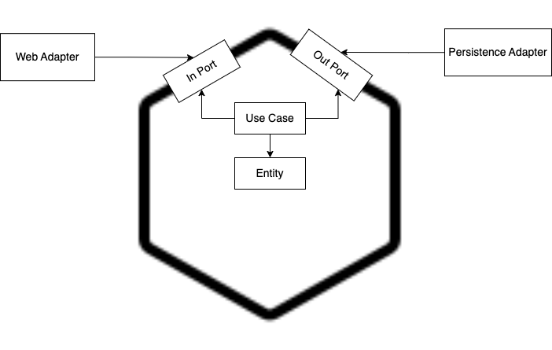

# USERS API
____________________

## Disclaimer:
I decided to do it with Hibernate and JPA because I am more familiar with using H2.

I used hexagonal architecture as pattern design.

I used Spring Boot 3, it's include a better way to handle a feedback error using RFC 7807, there is I not used a simple {"message": "some error"}  

Jacoco report for coverage.

Mockito

Junit 5

Java version: java 17.0.5-oracle
____________________
This is a service to persist and retrieve users.

##  Getting Started
____________________

### Parameters

To run this APP properly run correctly, the following properties must be configured.

For dev and local environment, simply you can use the default values on the specific property file.
The files are in on __src/main/resources__ and the name is application-{environment}.yamls

The BD schema is created when the application starts.

```
resources/bd/schema.sql
```

### Run test with coverage

* ```mvn clean verify```
* Then open `index.html` at `target/site/jacoco/` to see the coverage report.

### Run clean

* ```mvn clean```

### Run app locally

* ```mvn exec:java```

### Utils Url (local example)

#### URL SWAGGER UI
http://localhost:8080/swagger-ui/index.html#/

#### To CREATE an user
```
curl --location 'localhost:8080/v1/user/create' \
--header 'Content-Type: application/json' \
--data-raw '{
    "name": "Luis",
    "email": "w@dominio.cl",
    "password": "1234",
    "phones":[{
        "number": "12345678",
        "cityCode": "0",
        "countryCode": "56"
    }]
}   '
```
#### To GET an user by id
```
curl --location 'localhost:8080/v1/user/5afe3621-0471-4b32-80d8-13de9e838e5e'
```

#### To UPDATE an User
```
curl --location --request PUT 'localhost:8080/v1/user/update/5afe3621-0471-4b32-80d8-13de9e838e5e' \
--header 'Content-Type: application/json' \
--data-raw '{
    "name": "Ramon",
    "email": "wqq@dominio.cl",
    "password": "1234",
    "phones":[{
        "number": "999999999",
        "cityCode": "1",
        "countryCode": "54"
    },
    {
        "number": "8888888888",
        "cityCode": "2",
        "countryCode": "51"
    }]
}   '
```

#### To Deactivate an User
```
curl --location --request PATCH 'localhost:8080/v1/user/update/f3bfb949-e58e-46bd-94e5-8a0ddc6a1c5f'
```


This is the BD schema


This solution diagram
